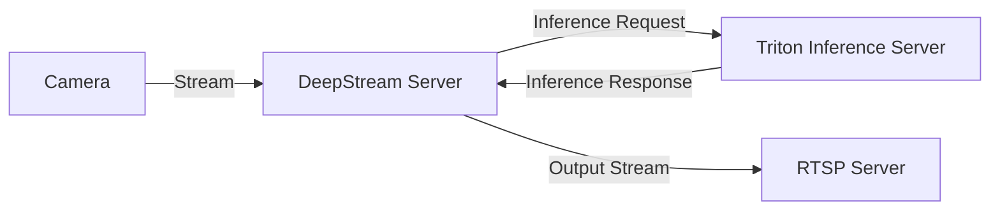

## Diagram of the Workflow


This diagram illustrates the following flow:
1. The camera streams video via RTSP to the DeepStream server.
2. The DeepStream server sends inference requests to the Triton Inference Server.
3. The Triton Inference Server processes the requests and sends the inference results back to the DeepStream server.
4. The DeepStream server outputs the processed video stream to an RTSP server.

## Usage

### Starting NVIDIA Triton Inference Server Container with Docker

#### Prerequisites

- Docker with support for [NVIDIA Container Toolkit](https://docs.nvidia.com/datacenter/cloud-native/container-toolkit/latest/install-guide.html) must be installed.
- NVIDIA GPU(s) should be available.

### Instructions

```bash
git clone https://github.com/salsasteve/ml-in-a-box.git
cd triton-server-yolo
# Start Docker container
bash ./start-container-triton-server.sh
```

### Starting Triton Inference Server

Inside Docker Container:

```bash
cd /apps
bash ./start-triton-server.sh \
--models yolov9-c,yolov7 \
--model_mode eval \
--efficient_nms enable \
--opt_batch_size 4 \
--max_batch_size 4 \
--instance_group 1
```

## Manual ONNX YOLOv7/v9 exports

### Exporting YOLOv7 Series from PyTorch to ONNX With Efficient NMS plugin

You can use the [Official Yolov7 Repository](https://github.com/WongKinYiu/yolov7):

```bash
python export.py --weights yolov7.pt \
  --grid \
  --end2end \
  --dynamic-batch \
  --simplify \
  --topk-all 100 \
  --iou-thres 0.65 \
  --conf-thres 0.35 \
  --img-size 640 640
```

### Exporting YOLOv9 Series from PyTorch to ONNX With Efficient NMS plugin

```bash
python3 export.py \
   --weights ./yolov9-c.pt \
   --imgsz 640 \
   --topk-all 100 \
   --iou-thres 0.65 \
   --conf-thres 0.35 \
   --include onnx_end2end
```

## Additional Configurations

For more details, see the [Triton Model Configuration Documentation](https://github.com/triton-inference-server/server/tree/main/docs).

Example of YOLO Configuration:

```plaintext
name: "yolov9-c"
platform: "tensorrt_plan"
max_batch_size: 8
input [
  {
    name: "images"
    data_type: TYPE_FP32
    dims: [ 3, 640, 640 ]
  }
]
output [
  {
    name: "num_dets"
    data_type: TYPE_INT32
    dims: [ 1 ]
  },
  {
    name: "det_boxes"
    data_type: TYPE_FP32
    dims: [ 100, 4 ]
  },
  {
    name: "det_scores"
    data_type: TYPE_FP32
    dims: [ 100 ]
  },
  {
    name: "det_classes"
    data_type: TYPE_INT32
    dims: [ 100 ]
  }
]
instance_group [
    {
      count: 4
      kind: KIND_GPU
      gpus: [ 0 ]
    }
]
version_policy: { latest: { num_versions: 1}}
dynamic_batching {
  max_queue_delay_microseconds: 3000
}
```
