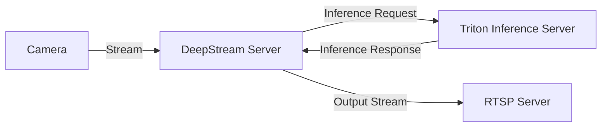

## Diagram of the Workflow


This diagram illustrates the following flow:
1. The camera streams video via RTSP to the DeepStream server.
2. The DeepStream server sends inference requests to the Triton Inference Server.
3. The Triton Inference Server processes the requests and sends the inference results back to the DeepStream server.
4. The DeepStream server outputs the processed video stream to an RTSP server.

## Usage

### Starting NVIDIA Triton Inference Server Container with Docker

#### Prerequisites

- Docker with support for [NVIDIA Container Toolkit](https://docs.nvidia.com/datacenter/cloud-native/container-toolkit/latest/install-guide.html) must be installed.
- NVIDIA GPU(s) should be available.

### Instructions

```bash
git clone https://github.com/salsasteve/ml-in-a-box.git
cd tools
# Start Docker container
python script.py --host-ports 8010,8011,8012 --container-ports 8000,8001,8002 --volume ../apps
```

### Starting Triton Inference Server

Inside Docker Container:!!!!!!!!!!!!!!!!!!!!!!!!!!!!!!!

```bash
cd /apps
bash ./start-triton-server.sh  \
--models yolov9-c,yolov7 \
--model_mode inference \
--efficient_nms enable \
--opt_batch_size 4 \
--max_batch_size 4 \
--instance_group 1 
```

### Deploy and Start DeepStream and Running rtsp in and rtsp out
Inside Docker Container:!!!!!!!!!!!!!!!!!!!!!!!!!!!!!!!
Also, make sure you change the ports in the pgie_inferserver_config.txt file
```bash
git clone https://github.com/levipereira/deepstream-yolo-triton-server-rtsp-out.git
python3 ds_yolo-ts_rtsp_out.py  \
-i rtsp://<username>:<password>@<ipaddress>:<port>/<somepathtocamera>  \
-m  yolov9-c \
-c H264
```

